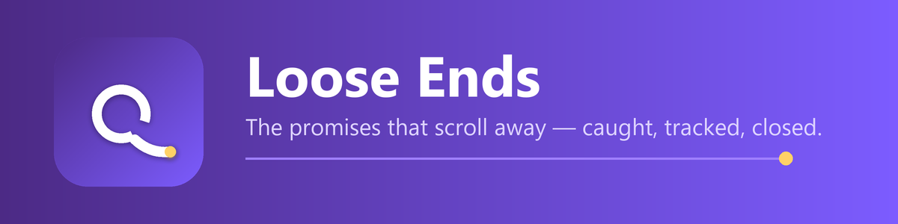
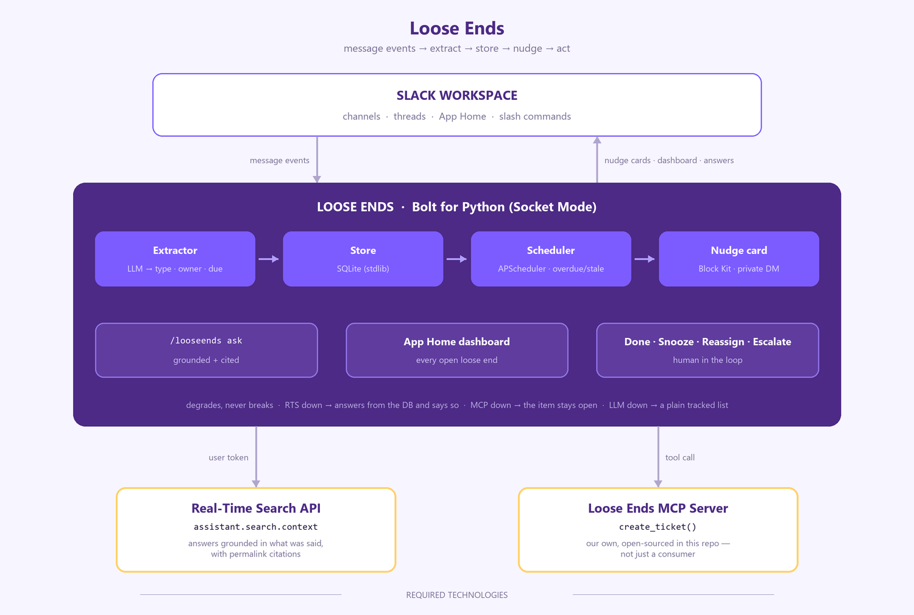

<div align="center">



<br>

**Slack forgets what you promised. Loose Ends doesn't.**

[](LICENSE)
[](https://python.org)
[](https://slack.dev/bolt-python)
[](./mcp-server)
[](#how-it-uses-the-slack-platform)

<br>

### ▶️ [Watch the 2-minute demo](https://youtu.be/L8skXKj7fLw)

**Judges:** the workspace to open is the **[judging mirror](https://looseends-judging.enterprise.slack.com)** — [here's why there are two](#-two-slack-workspaces--and-which-one-to-open).

</div>

---

## 🪢 In 30 seconds

> **You:** "I'll send the Q3 deck by Friday."
> *Three days later, nobody has the deck.*

Every team drops balls. Not because people don't care — because **the promise lives in a
chat message, and chat scrolls away.** Nobody re-reads Tuesday's thread.

**Loose Ends is the safety net.** It reads your channels, catches the two things that get
dropped, and refuses to let them vanish:

| | It catches | Example |
|---|---|---|
| 🤝 | **Commitments** | *"I'll send the deck Friday"* · *"on it, will fix tonight"* |
| ❓ | **Unanswered questions** | *"who's handling the prod deploy?"* — and nobody replied |

Then, when a promise goes overdue or a question goes stale, it **DMs you privately** — never
a public call-out — with one click to act:

<div align="center">

**✅ Done** · **😴 Snooze** · **↪ Reassign** · **📌 Escalate → a real ticket**

</div>

Escalate files that forgotten promise as a tracked ticket through **our own open-source
[MCP server](./mcp-server)**. And `/looseends ask "what did I commit to this week?"` answers
from what was *actually said* in your workspace, with citations.

### 🤫 The hard part isn't catching things. It's shutting up.

*"lol same"* · *"the build is green"* · *"gm everyone"* — **ignored.** All of it.

An agent that nags you about nothing gets muted on day one, so the extractor is tuned so
that **false positives are worse than misses**. Restraint is the feature.

---

## 🔌 How it uses the Slack platform

The challenge asks for **one** of three required technologies. Loose Ends ships **two** —
and both are load-bearing, not bolted on:

| Technology | How Loose Ends uses it |
|---|---|
| **MCP server integration** | **Escalate** calls our own standalone [MCP server](./mcp-server) — we don't just consume an MCP server, we ship one. Its `create_ticket` tool turns a forgotten Slack promise into a tracked ticket. Open-sourced in this repo. |
| **Real-Time Search API** | `/looseends ask "what did I commit to this week?"` calls **`assistant.search.context`** to ground the answer in what was *actually said* in the workspace, with permalink citations rather than guesses. |

**On the extraction engine:** the classifier in `src/llm.py` runs on Claude via an
OpenAI-compatible gateway (DGrid) — that's our own engine, **not a Slack AI feature, and we
don't claim it as one.** It's a deliberately thin wrapper: repoint `DGRID_BASE_URL` at any
OpenAI-compatible endpoint, including a self-hosted model, and nothing else changes.

---

## 🏗️ Architecture

<div align="center">
  
</div>

```
message events → extractor (LLM) → SQLite → scheduler → Block Kit nudge → actions
                                                 ↓
                          App Home dashboard · /looseends ask (RTS) · Escalate (MCP)
```

### 🛡️ Failure is designed in

Every layer degrades instead of breaking — because a demo that dies on stage is worth
nothing, and neither is an agent that dies on a Tuesday.

| When this breaks | What actually happens |
|---|---|
| 🔎 **RTS unavailable** | `/ask` answers from the database — **and says so in the footer** |
| 🧠 **LLM gateway down** | You still get a plain tracked list. Nothing is lost |
| 📌 **MCP server down** | Escalate reports it, and the item stays **open** — never a silent failure |

> The core loop — **detect → store → nudge → act** — needs nothing but the bot token.

### 📁 Files

| File | Role |
|---|---|
| `src/app.py` | Bolt app: events, capture, buttons, modals, slash command |
| `src/llm.py` | LLM extractor + grounded answer writer |
| `src/duedate.py` | "friday" / "by EOD" / "tonight" → epoch ms |
| `src/db.py` | SQLite storage (stdlib `sqlite3`) |
| `src/scheduler.py` | APScheduler nudge engine (overdue + stale) |
| `src/nudge.py` | State-aware Block Kit card renderer |
| `src/home.py` | App Home dashboard |
| `src/rts.py` | Real-Time Search client (`assistant.search.context`) |
| `src/ask.py` | `/looseends ask` — grounded, cited answers |
| `src/mcp_client.py` | Resilient MCP client for Escalate |
| `mcp-server/` | **Standalone open-source MCP server** (FastMCP) |

---

## 🧭 Two Slack workspaces — and which one to open

**Judges: open the second one.** It is a mirror, running the same code, seeded with the same
demo state, and it is the only one you can be let into.

| Workspace | Link | What it is |
|---|---|---|
| **`looseend`** — original | [e0bg8dum7rd-k5o8cryx.slack.com](https://e0bg8dum7rd-k5o8cryx.slack.com) | Where Loose Ends was built and where the demo video was recorded. **Judges cannot be invited to it** (see below). |
| **`Loose Ends Judging`** — mirror | [looseends-judging.enterprise.slack.com](https://looseends-judging.enterprise.slack.com) | **The one to open.** Same app, same seeded loose ends. `testing@devpost.com` and `slackhack@salesforce.com` are invited. |

### Why there are two

A Slack developer sandbox is hard-capped at **eight users**, and that cap counts accounts,
not active ones — deactivating someone does not free a seat.

The original sandbox was provisioned from the **template** option, which ships with *seven
system-created demo users*. Seven fake users plus the owner is eight. It was full from the
moment it was created: every invite, as member *or* guest, fails with

> *"You've hit the maximum number of users for this sandbox. To add someone new, remove an existing user first."*

The fix is a second sandbox provisioned **empty** (one user instead of seven), which leaves
seats free. The app was rebuilt there from [`manifest.yaml`](./manifest.yaml) — one paste, same
scopes, same events — and re-seeded. Nothing about the agent differs between the two; only the
guest list does.

The [demo video](https://youtu.be/L8skXKj7fLw) was recorded in the original workspace, which is
why the permalinks in it point at that domain. The mirror is where you can actually click things.

### Running against either one

One process talks to one workspace — a Socket Mode connection is bound to a single bot token.
So pick the workspace with an env file rather than editing tokens back and forth:

```bash
.venv/Scripts/python.exe -u -m src.app                          # .env          → judging mirror
ENV_FILE=.env.looseend .venv/Scripts/python.exe -u -m src.app   # .env.looseend → original
```

Give each env file its own `LOOSEENDS_DB`, or both workspaces write their loose ends into the
same SQLite file and each dashboard shows the other's items.

---

## 🚀 Quick start

```bash
python -m venv .venv
.venv/Scripts/pip install -r requirements.txt      # Windows; else .venv/bin/pip
cp .env.example .env                                # fill in your tokens
```

Two processes:

```bash
# 1. the MCP ticket server
cd mcp-server && ../.venv/Scripts/python.exe -u server.py    # → 127.0.0.1:8765

# 2. the Slack app (Socket Mode — no public URL needed)
.venv/Scripts/python.exe -u -m src.app
```

Invite the bot to a channel, then say something you'd regret forgetting.

### ⚙️ Slack app configuration

**Bot scopes:** `app_mentions:read`, `channels:history`, `groups:history`, `chat:write`,
`commands`, `im:write`, `im:history`, `users:read`, `reactions:write`
**User scope (for RTS):** `search:read.public`
**Events:** `message.channels`, `message.groups`, `app_mention`, `app_home_opened`
**Also:** Socket Mode on, Interactivity on, App Home **Home tab + Messages tab** enabled
(the Messages tab is required — without it the bot can't DM nudges), `/looseends` command.

> **On the RTS user token:** `/looseends ask` needs a `xoxp-` **user** token. Bot-token RTS
> calls require an `action_token` that Slack only mints inside message events, so a slash
> command can't use one. Add `search:read.public` under **User** Token Scopes, reinstall,
> and set `SLACK_USER_TOKEN`. Leave it unset and `/ask` transparently falls back to DB-only.

### 💬 Commands

| Command | Does |
|---|---|
| `/looseends` | Everything you're on the hook for |
| `/looseends ask <question>` | 🔎 Grounded, **cited** answer (RTS + your tracked items) |
| `/looseends check` | Run the overdue/stale sweep right now |
| `/looseends help` | What I can do |

### 🧪 Scripts

```bash
scripts/seed_demo.py      # reset to a clean, known demo state
scripts/rts_smoke.py      # verify the RTS path end to end
scripts/extract_smoke.py  # extractor accuracy check  → 12/12 on the fixture set
scripts/db_smoke.py       # storage smoke test
scripts/list_ends.py      # dump tracked loose ends
scripts/make_logo.py      # re-render the app icon    (needs `pillow`)
scripts/make_arch.py      # re-render the architecture diagram
scripts/make_banner.py    # re-render the App Home banner
```

### ☁️ Run it 24/7

The agent only exists while its process is alive — a judge who opens the App Home to a dead
tab sees nothing. [`deploy/`](./deploy) puts it on an EC2 `t4g.micro` (~$6/month) under
systemd, running **both workspaces off one box**: a shared MCP ticket server plus one app
process per workspace (`looseends-app@judging`, `looseends-app@looseend`), each with its own
bot token and its own database. Socket Mode is outbound-only and the MCP server binds
loopback, so the box needs **zero inbound ports** — nothing to attack.

---

<div align="center">
  
</div>

## 🎨 Brand

The mark is **a loop of thread that never got tied off**, trailing away to a frayed gold
end — the loose end itself. `assets/logo.svg`, rendered to `assets/logo-512.png` for the
Slack app icon and composited into `assets/banner.png` for the App Home.

---

## 🔒 Data handling & security

Be able to answer these before you install this anywhere real.

**What leaves the workspace.** Every message posted in a channel the bot is invited to
(longer than a few characters, excluding bot messages) is sent to an **LLM gateway** —
by default [DGrid](https://dgrid.ai), an OpenAI-compatible endpoint — for classification.
That is a third party receiving your team's conversations. `src/llm.py` is a deliberately
thin wrapper: point `DGRID_BASE_URL` at any OpenAI-compatible endpoint, including a
self-hosted or in-VPC model, and nothing else changes. The bot is only ever in the channels
you invite it to.

**What's stored.** Loose ends live in a local SQLite file: the summary, owner, channel,
message timestamp, due date, and status. Message bodies are not stored — only the short
summary the extractor produces. Nothing is sent anywhere except Slack, the LLM gateway,
and your MCP connector.

**Real-Time Search runs as the asking user.** `/looseends ask` uses a `xoxp-` user token
scoped to `search:read.public`, so it can only ever surface messages that user could
already read. It cannot widen anyone's access.

**The MCP server has no authentication.** It binds `127.0.0.1` and is meant to run beside
the app. If you change `MCP_HOST`, anyone who can reach the port can create tickets — put
real auth in front of it first. It warns you on startup if you bind it off-loopback.

**Nudges are private.** The agent DMs the owner. It never posts a public call-out, and it
never @-mentions someone to shame them into acting.

**Known limits.** A crafted message could try to talk the extractor into creating a bogus
loose end, or steer an `/ask` answer — the blast radius is a wrong card, and every action
still needs a human to click. There's no rate limiting: an LLM call fires per qualifying
message, so a busy channel costs money.

---

## 🔮 What's next

- **🎫 Real connectors.** The MCP server ships a mock ticket store; the `create_ticket`
  contract is already the right shape for Jira/Linear. Swapping it doesn't touch the Slack app.
- **🌙 Learning the owner's rhythm** — nudge when someone is actually free, not at 2am.
- **🏪 Marketplace listing** as a drop-in accountability layer for any workspace.
  ([What that actually takes.](./MARKETPLACE.md))

## 🧱 Stack

<div align="center">

| Layer | Choice |
|---|---|
| 💬 **Slack** | Bolt for Python · Socket Mode · Block Kit |
| 🧠 **Extraction** | Claude, via an OpenAI-compatible gateway (swappable) |
| 💾 **Storage** | stdlib SQLite — zero infra |
| ⏰ **Scheduling** | APScheduler |
| 📌 **Tickets** | our own [open-source MCP server](./mcp-server) |
| 🔎 **Grounding** | Slack Real-Time Search (`assistant.search.context`) |

</div>

## 📚 More

| Doc | What's in it |
|---|---|
| [`PROJECT_SPEC.md`](./PROJECT_SPEC.md) | Data model, Slack scopes, event subscriptions |
| [`DEMO_SCRIPT.md`](./DEMO_SCRIPT.md) | The 3-minute demo run-of-show |
| [`deploy/`](./deploy) | Run it 24/7 on AWS |
| [`MARKETPLACE.md`](./MARKETPLACE.md) | An honest audit of what a Slack Marketplace listing needs |

---

## 📄 License

[MIT](LICENSE) — do what you like with it.

<div align="center">
<br>
<sub>Built solo for the <b>Slack Agent Builder Challenge</b> 🪢</sub>
</div>
